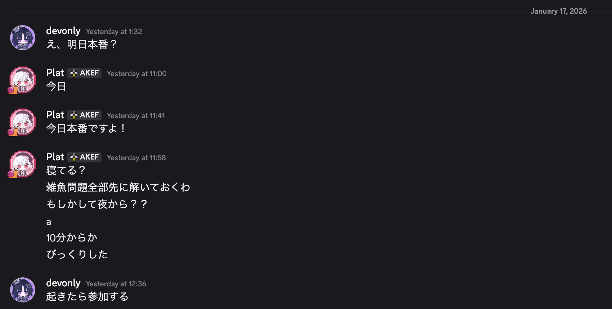
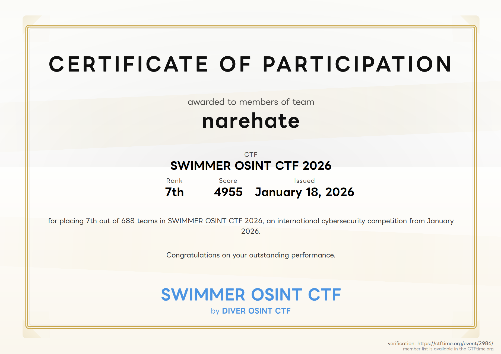

## 概要

DIVER OSING CTF 2025に続いて、二度目の参加になります。

- [https://swimmer.diverctf.org/](https://swimmer.diverctf.org/)

> OSINT (オシントと読む) とは、Open Source Intelligence の略で、日本語にするなら公開情報調査になるそうです。その名の通り、公開されている情報を合法的な手段を用いて収集し、調査・分析することを指します。OSINT CTF というのは、OSINT に CTF (Capture The Flag) の要素を組み合わせたもので、公開情報をもとに、指定されたフラグとなる情報を探し出す ことを競います。

前回は一日目はまるまる徹夜明けでホテルのビュッフェを食べに行ってそのまま爆睡して12時間くらい無駄にしてメンバーのに迷惑をかけたので、今回は頑張ろうと意気込んでいました。

> まのさばのネタバレはありません。

### 前フリ



夜からやればいいやとスヤスヤしていたのですが、開始時間になってsakurabaさんからの熱烈なモーニングコールで目を覚ましました。


どうやら、SWIMMERの方は開催時間が12時間しかないようです。

じゃあ今からやらないとマズいじゃん、とそこから競技を開始しました。次からはちゃんと時間を確認しようと思いました。

## メンバー紹介

今回はチーム[narehate](https://swimmer.diverctf.org/teams/10)として参加しました。メンバーは前回と同じ二人です。

### [sakuraba](https://bsky.app/profile/p1at.dev)

今回の主犯、犯人、そして私をチームに誘ったリーダーで、Team `narehate`でスペックの高い方の人。


前回のCTFを一緒にやってみた感想だと、手当たり次第に全部チャレンジしてみて解けそうな問題の目処をざっくりつけて、そういう問題はキッチリ解いてくるタイプ。

個人的に、そういう判断をパッとつけられるのは自分の実力、そして問題の難易度をすぐに見極める能力が必要で、誰しもができるわけではない才能の一つだと思っている。

> sakurabaさんのWriteupは[こちら](https://blog.p1at.dev/blog/2026/01/17)からどうぞ。

### [nikaido](https://bsky.app/profile/tkgstrator.work)

時間を守らない・確認しないカスで、Team `narehate`で役に立たない方の人。


sakurabaさんが「時間がかかりそうだな」と思った問題を裏でいろいろ試してみるタイプの、いわゆる補佐役。

DIVER OSINT 2025では難しい問題は配点が高かったので、そこそこ点数が稼げたのに今回は初級者向けかつヒントがどんどんできたので最終的にスコアが748と悲しいことになってしまった。

> 最終的になんかスコアが増えて968になったのだが詳細は不明

逆張り思考なので、sakurabaさんとはアプローチが違うことも多く、CTFにおいてはこの二人は相性がなかなかいいのではないかと思っている。

## 問題解説

自分が手を付けた問題だけ、考えたことや試したことを書きます。

解けなかった問題も、どう考えたのかだけ書いておきます。

### rain_01_social

ユーザー名を探す問題です。

該当するツイートを調べて、引用リツイートしているアカウントを探すだけです。

> Xのアカウントは複数持っていたのですが、一方だと引用リツイートしているアカウント一覧が見れなくて困りました。

簡単なので解説は割愛。

### rain_02_region

最初、問題の意図がわかりませんでした。

「フェイクの画像」の意味する言葉が、自分が実際に撮影していないという意味かと思っていたのですが「フェイク=生成AI」という意味だったらしいです。


それに気付いたのは近畿日本鉄道の画像で、本来「特急」や「急行」が表示されるべき領域に行き先が書いてあったので「あれ、おかしいな」となり、よくよく見てみると駅の看板だったり文字だったりが変な上に、Geminiで生成したWatermarkが入っていたので、この時点でこの画像が生成AIであることがわかりました。

この時点では「実際に撮影した画像を生成AIで改ざんしているのか」と思って調査を開始したのですが、近畿日本鉄道に複々線がある駅は「大阪上本町」「鶴橋」「今里」「布施」の四駅しかなく、そのどれとも違うので「そもそも無から生成したのでは」と思い始めました。


確信に至ったのが「阪急」の写真で、乗客がプラットフォームにいるにも関わらず傘を刺していたり、本来ターミナル駅で建物の中にあるはずの「梅田駅」（阪急梅田駅はない）が外にあったりして、ここでようやく「正解以外は全て生成AIで作られた画像である」という事に気が付きました。

じゃあどれが本物なのかな、ということになるわけですね。

以前、生成AIで作られた画像を見抜けという問題で90/100を出した審美眼を発揮しようかと思ったのですが、思わぬところで答えが見つかりました。


それが京阪電車の写真で、これがたまたま実家の近所だったので「枚方・私市」という行き先、「普通」（交野線は普通しか走っていない）、ワンマン（交野線はワンマン）というところから「これは本物の写真ではないか」と気付きました。


また、階段あたりの紫色の掲示のところも「交野市」（地元なので読める）と書いてあり、反対のホームの枚方自動車教習所の広告もよく見るものだったので、これが本物の写真だと確信できました。

駅名が三文字であることはなんとなく画像から読み取れますが、交野線で駅名が三文字でこのような形になりそうなのは「星ヶ丘」しかないので、路線図を見ずとも答えがわかりました。

地元だとすぐに分かるので、この問題を自分に割り当てられたのは結果的に良かったと思います。

### rain_03_source1

> 最終解決はsakurabaさんがしてくれました


これは問題がよくわからなかった問題でした。

結論から言うと「全く関係のないキャプション」とは、記事のタイトルや内容のことでした。ずっと画像のラベルのことかと思ってクリッピングして思考から外していたのが失敗でした。

エンボス加工の印があり「館」という文字はすぐに読めて、圖（図の旧字体）があるので「図書館」であることはわかりました。

旧字体を使うとなると歴史のある図書館の資料ですので、必然的に候補は絞られます。当然、国立国会図書館（旧帝国図書館）は思いついたのですが、ラベルが間違っていると思っているのでなんと検索していいのかわかりませんでした。

結果的にsakurabaさんが解いてくれたのですが、単に画像を国立国会図書館の画像検索に突っ込んだらいいそうです（なんだそりゃ

### rain_04_source2


古い国会議事堂の画像なので、国会国立図書館デジタルアーカイブで検索します。

それで答えが出てきます。

最初東京駅かなと思ったのはここだけの秘密です。

簡単なのでこれも割愛。

### rain_05_date

> 最終解決はsakurabaさんがしてくれました


大阪城ホールのイベント一覧を見て、看板の文字と合いそうなものを探していたのですが、sakurabaさんがGeminiに突っ込んだら看板の文字の一部は「10000」ではないかとのヒントを得ていました。

そこから、調べるとすぐにヒットし、季節も周りの方が冬っぽい服装をしていたので（ここは全然考慮しておらず、指摘を頂いて気付いた）正解を確信。

地元なだけにAIに勝ちたかったですが、Geminiの方が一枚上手でした。

### debeyohiru_05_hidden1

> sakurabaさんの引き継ぎをする感じで取り組みました

GitHubの公開鍵にでも載ってるのかなと思ったのですが、ありませんでした。

```js
/**
 * スクロール位置に応じてヘッダーのスタイルを変更する
 * ページ上部ではより透明に、スクロール時は不透明になる
 * @author Gotanno Tsubasa
 */
function initHeaderScroll() {
    const header = document.querySelector('header');

    window.addEventListener('scroll', () => {
        if (window.scrollY > 100) {
            header.classList.add('scrolled');
        } else {
            header.classList.remove('scrolled');
        }
    });
}
```

が、[ソースコード](https://furaigo5.github.io/profile/js/script.js)にベタ書きしていたので見つけられました。sakurabaさんも先に挑戦していたらしいのですが、あまりに初歩的すぎて見逃していたようです。

### lilica_07_work

> sakurabaさんの引き継ぎをする感じで取り組みました

Xのアカウント自体はsakurabaさんが先に見つけていたので、別のSNSアカウントを探すことにしました。

たまたま同じ方法を取っていたのですが、FBXのバイナリを見ると名前が埋め込まれていました。

DIVER OSINT 2025でInstagramのアカウントを持っていなくて解けない問題があったので、今回は予め作っておいたのが功を奏しました。

アカウント([nanaogi_shiharu](https://www.instagram.com/nanaogi_shiharu/))名で検索すると画像と共に「休憩時間に撮った」というメッセージがあるので、その画像の場所を特定します。

### lattice_tower

> sakurabaさんの引き継ぎをする感じで取り組みました

建物はわかるけど、正式名称がわからないとのことです。

確かにググッてもニュースの記事ばかりでした。

が、こういう正式名称は公式ページにありがちなので、ドメイン指定でNTTに絞り込みました。

するとそれっぽい[ページ](https://www.ntt-east.co.jp/info-st/mutial/teltower/)が見つかり、青森県の例の建物の正式名称がわかりました。

が、入力途中に日本語変換で勝手にSubmitされるというバグを踏んでレートリミットに引っかかったので、最終入力はsakurabaさんに任せました。

### debeyohiru_04_meal

> sakurabaさんの引き継ぎをする感じで取り組みました

が、ほぼ自己解決されていました。

「なんかヒントあるんじゃないの」と質問してみたら「見てくる」とのこと。

すると、同日に他にも投稿された画像があるという匂わせがあったので、その他のSNSを調べてみるもヒットせず。「じゃあ食べログだったり？」とのアイデアをsakurabaさんが発案、調べてみるもこちらは空振りでしたがGoogleのレビューで見つけてくれました。

冬限定メニューでリンゴが乗っているものは一つしかなかったので、それが答えでした。

### debeyohiru_06_hidden2

> 最終解決はsakurabaさんがしてくれました

現在の端末はすぐにわかるのですが、買い替えたらしいので「おそらくどちらかが変わっているのだろう」ということはすぐに分かりました。

GitHub Pagesでホスティングされているのでコミットが追えればいいのですが、こちらの方面からは解けず。アーカイブにあるんじゃないかと[https://web.archive.org](https://web.archive.org/)で調べるもヒットせず。

どうしたものかと考えていると、sakurabaさんが別のアーカイブサービスで見つけてくれました。

方針に自信があるときは、ちゃんと最後までやれという教訓になりました。

### ops_swimmer

全問解けたので、最後のおまけ問題に取り組みました。

解いている流れで三人が合流している投稿や、Googleのカレンダーをsakurabaさんが見つけてくれていたので、後は集合場所を特定するだけでした。

品川区ということはわかっていて、系列もわかっているのであとは店舗を特定するだけです。

品川区には複数店舗があるのですが、候補を見ているとたまたま「これっていつも泊まってる阪急大井町ガーデンのところなんじゃ？」という既視感がでてきて、調べたらビンゴ。

全店舗探しても大したコストではないものの、早く見つけられたのは良かったです。

結果的には、ここで数秒早く決断できたことで順位が上がったので（ひとつ下のチームとは8秒差でした

## まとめ

前回に引き続き、[またしても何もしていない](https://cdn.bsky.app/img/feed_fullsize/plain/did:plc:3hpgxglzqzzfviegqamesrfd/bafkreig3tzaozv34p57evojrayzjyhcofaymlorvdpo5ponm5xndhngdzq)のですが、ただチームメンバーに居座っているだけで全687チーム中7位に入賞することができました。




自分たちより上位のチームはメンバーが六人なので、二人でこの順位はなかなか頑張ったのではないかと思います。


ぶっちゃけsakurabaさんのスペックがかなり高いので、次回以降、


とならないか、不安で仕方がありません。

寝坊ぶっこいたり、`rain_03_source1`で二時間もかけたりしなければもう少し順位を上げられたかも知れないだけに、悔やまれるところです。この問題、絶対に許さないゾ。

記事は以上。