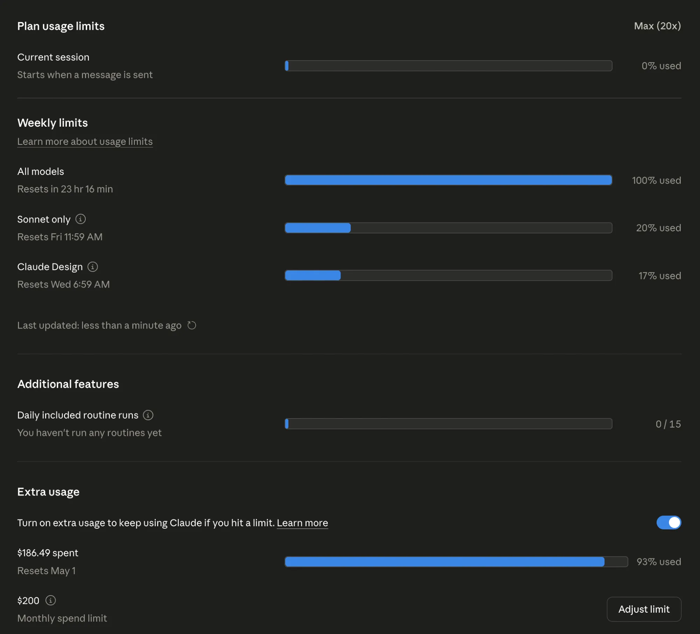

## 概要

https://claude.com/pricing

Claude Codeで最初はMax x5で遊んでいたのですが、担当するプロジェクトが多くなるとx5ではちょっと足りなくなり、じゃあx20にしておけば余裕かな〜と思っていた時期が私にもありました。

```zsh
app (master) | Opus 4.6 | $24.13 | ctx:-% | 5h:0%(26m) 7d:100%(20h26m)    Now using extra usage
-- INSERT --                                                                           0 tokens
```

嘘だよな......

というわけで$200のプランでもガッツリ使っていると全然足りないことがわかりました。

ただ、以前APIのクレジットをいくらかもらっていたので、二日くらいならそれで耐えられるかな、と考えてもいました。



あ、これダメなやつだ！！！！！

### 暫定対応

自分はGitHub Copilot Pro+のプランも契約していたので、そっちでGPT-5.4 Xhighでなんとか耐えています。ちょっと使ってみたのですが、プレミアムリクエストの課金がOpus 4.7の1/7.5なのに結構いい感じで使えています。

うーん、自分はほとんどすべてのコーディングをOpus 4.6/4.7に丸投げしていたんですけど、簡単なタスクはSonnetとかに任せたほうがいいのかもしれません。

## GitHub Copilot / Claude Code / Codexの料金比較

2026年4月時点で、公式ページベースの料金をざっくり比較するとこんな感じです。個人向けプランだけに絞っていて、Claude CodeとCodexは単体プランというより上位プランに含まれる形なのでその前提で見たほうがわかりやすいです。

### GitHub Copilot

| プラン | 月額 | 課金単位 | メモ |
| --- | --- | --- | --- |
| Free | $0 | 個人 | 補完2,000件/月、プレミアムリクエスト50件/月 |
| Pro | $10 | 1ユーザー/月 | 個人向け、プレミアムリクエスト300件/月 |
| Pro+ | $39 | 1ユーザー/月 | 個人向け上位、プレミアムリクエスト1,500件/月 |

### Claude Code

| プラン | 月額 | 課金単位 | メモ |
| --- | --- | --- | --- |
| Claude Pro | $17/月 年額払い または $20/月 月額払い | 個人 | Claude Codeを含む |
| Claude Max 5x | $100 | 個人 | Proの5x利用枠 |
| Claude Max 20x | $200 | 個人 | Proの20x利用枠 |
| API | 従量課金 | トークン課金 | Opus 4.7は入力$5/MTok、出力$25/MTok |

### Codex

| プラン | 月額 | 課金単位 | メモ |
| --- | --- | --- | --- |
| ChatGPT Plus | $20 | 個人 | Codexを含む |
| ChatGPT Pro 5x | $100 | 個人 | Plus比で5xの利用枠 |
| ChatGPT Pro 20x | $200 | 個人 | Plus比で20xの利用枠 |

### ざっくり見た感想

| 比較軸 | いちばん安い入口 |
| --- | --- |
| GitHub Copilotを個人で使う | Copilot Pro: $10/月 |
| Claude Codeを個人で使う | Claude Pro: $20/月 |
| Codexを個人で使う | ChatGPT Plus: $20/月 |

GitHub Copilotは単体サービスとしてはかなり入りやすいです。一方でClaude CodeとCodexは、それぞれClaude/ChatGPTの有料プランに含まれる形なので、コーディング以外の機能も込みで払う感じになります。

### ソース

- GitHub Copilot Plans: https://docs.github.com/en/copilot/get-started/plans
- GitHub Copilot Pricing: https://github.com/features/copilot/plans
- Claude Pricing: https://claude.com/pricing
- Claude Code Overview: https://docs.anthropic.com/en/docs/claude-code/overview
- Claude Code Costs: https://docs.anthropic.com/en/docs/claude-code/costs
- OpenAI Codex: https://developers.openai.com/codex
- ChatGPT Pricing: https://chatgpt.com/pricing
- ChatGPT Pro tiers: https://help.openai.com/en/articles/9793128-about-chatgpt-pro-plans
